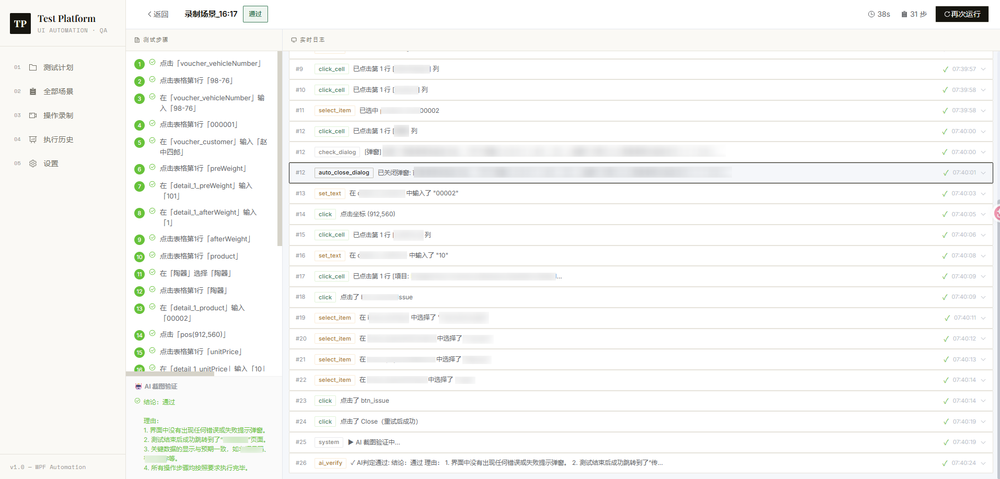
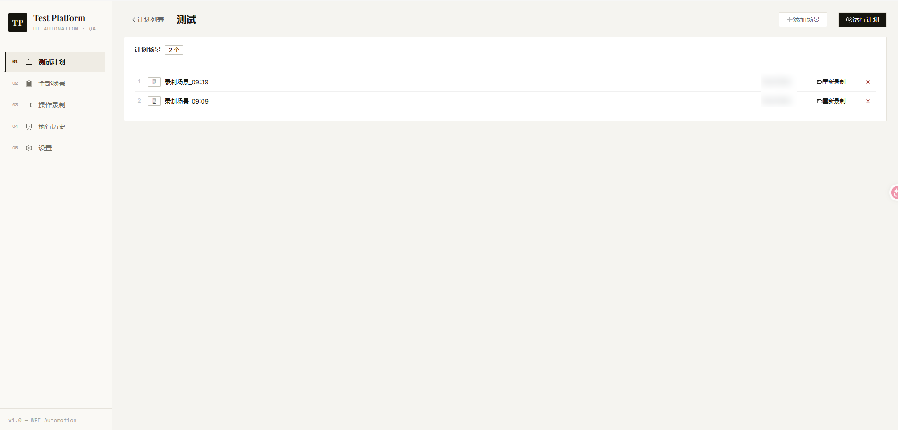
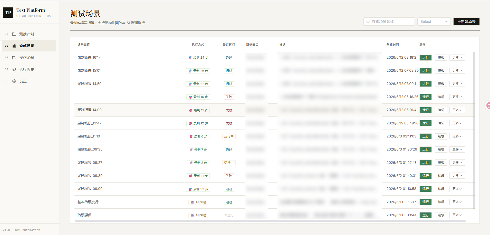
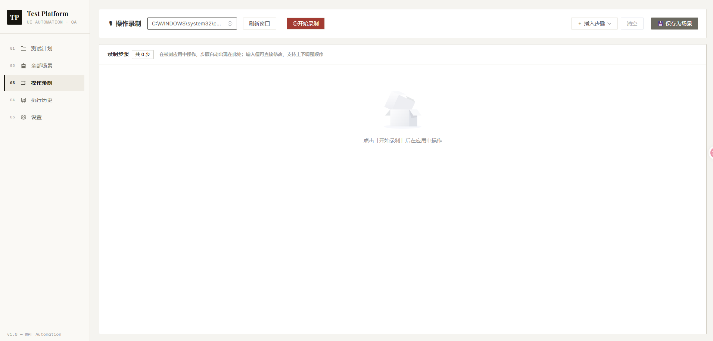
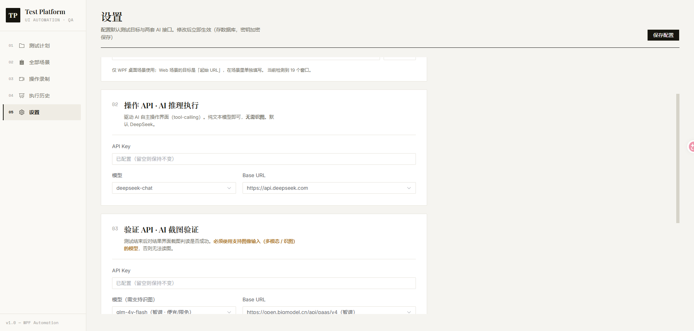

# TestPlatform — AI 驱动的 WPF 桌面 & Web 网页自动化测试平台

> 面向 **WPF 桌面应用与 Web 网页** 的智能自动化测试平台。
> 桌面走 Windows UIAutomation、网页走 Playwright，两端共用同一套 **AI 推理执行**、**录制回放**、**AI 截图验证**，
> 通过 SignalR 实时推送每一步执行过程。


*实时监控页：逐步展示工具调用、参数、结果与 AI 思考，底部给出最终判定*

> 💡 **提高准确率的关键**：平台通过 Windows UIAutomation 的 `AutomationId` 定位控件。
> **建议在被测 WPF 项目中为关键控件设置 `AutomationProperties.AutomationId`**——
> 控件有稳定的 AutomationId 时，录制回放与 AI 操作都能精确命中；
> 缺失时只能退回名称/坐标匹配，准确率与跨环境稳定性都会明显下降。

---

## 功能亮点

| 功能 | 说明 |
|------|------|
| **WPF + Web 双端** | 同一平台覆盖 Windows 桌面（UIAutomation）与网页（Playwright），下列能力两端通用 |
| **AI 推理执行** | 接入 DeepSeek，通过 Tool Calling 让 LLM 逐步操作 WPF 控件或网页元素，自动完成未录制的探索性场景 |
| **录制回放** | 桌面（鼠标/键盘/UIAutomation 三路合流）或网页（注入脚本采集点击/输入/选择）录制操作，一键回放，无需写代码 |
| **结构化验证** | 回放结束按 `equals/contains/exists/textVisible/noDialog…` 等条件判定，而非仅看步骤是否报错 |
| **AI 截图验证** | 执行完对结果界面截图，交多模态模型独立判断「是否真的成功」，可与结构化验证叠加 |
| **测试计划** | 把多个场景编成计划，顺序批量执行并统计通过/失败 |
| **实时监控** | SignalR 实时推送每步日志、AI 思考过程、录制步骤与最终结果 |
| **参数化场景** | 描述与步骤中用 `{{参数名}}` 占位，运行时注入实际值 |
| **可视化设置** | 「设置」页在线管理两套 AI 接口配置，API Key 加密落库、不回传明文 |

---

## 技术栈

**后端** — ASP.NET Core 9 Web API，目标框架 `net9.0-windows`

- Windows UIAutomation + WPF/WinForms Runtime（桌面控件驱动，强依赖 Windows）
- Win32 低级鼠标/键盘钩子（`WH_MOUSE_LL` / `WH_KEYBOARD_LL`，桌面操作录制）
- Microsoft Playwright 1.60（Web 浏览器自动化与录制；优先用自带 Chromium 内核，缺失时自动回退系统 Edge/Chrome 兜底）
- SqlSugar ORM + PostgreSQL（CodeFirst 自动建表）
- ASP.NET Core SignalR（实时推送）
- DeepSeek（文本推理，Tool Calling）+ 任意 OpenAI 兼容多模态模型（截图验证）
- System.Drawing.Common（桌面截图）

**前端** — Vue 3 + TypeScript + Vite

- Element Plus UI 组件库 · Pinia 状态管理 · Vue Router
- `@microsoft/signalr` 实时客户端 · Axios
- 设计风格：瑞士排版编辑风（暖纸浅底 + 衬线/等宽混排，无渐变）

> ✅ **WPF 桌面与 Web 网页双端均已支持**：桌面走 Windows UIAutomation，网页走 Playwright；
> 两端都支持 **AI 推理执行** 与 **录制回放**，并共用 **AI 截图验证**。
> Web 浏览器优先用 Playwright 自带内核，缺失时自动回退系统 Edge/Chrome 兜底（无需额外下载）。
> 仓库内置静态靶子 [`samples/web-demo/`](samples/web-demo/) 可直接体验 Web 自动化。后续规划见 [docs/TODO.md](docs/TODO.md)。

---

## 快速开始

### 前置要求

- Windows 10/11（后端强依赖 Windows UIAutomation，**不可在 Linux/macOS 运行**）
- .NET 9 SDK
- Node.js 18+
- PostgreSQL 14+
- DeepSeek API Key（AI 模式必需）；多模态模型 Key（启用 AI 截图验证时需要）

### 1. 配置数据库与 AI 接口

编辑 `src/TestPlatform.API/appsettings.json`：

```json
{
  "ConnectionStrings": {
    "Default": "Host=localhost;Port=5432;Database=test_platform;Username=postgres;Password=你的密码"
  },
  "DeepSeek": {
    "ApiKey": "sk-xxxxxxxx",
    "Model": "deepseek-chat",
    "BaseUrl": "https://api.deepseek.com"
  },
  "AiVision": {
    "ApiKey": "",
    "Model": "qwen-vl-max",
    "BaseUrl": "https://dashscope.aliyuncs.com/compatible-mode"
  }
}
```

- `DeepSeek` 用于**操作**（纯文本推理，无需识图）。
- `AiVision` 用于**截图验证**（需多模态模型，如 `qwen-vl-max` / `gpt-4o`；留空则 AI 验证自动跳过）。
- 以上也可在启动后于「设置」页在线修改，API Key 会**加密存库**并优先于 `appsettings.json` 生效。

数据库会在首次启动时**自动创建 + 迁移**，无需手动建表。

### 2. 启动后端

```powershell
# 目标框架必须是 net9.0-windows（依赖 WPF / UIAutomation）
dotnet run --project src/TestPlatform.API/TestPlatform.API.csproj --framework net9.0-windows
```

默认监听 `http://localhost:5000`（与前端请求的 `http://localhost:5000/api` 及 SignalR `/hubs/test` 一致，开箱即用）。
本地 DeepSeek Key 可放进 `appsettings.Development.json`（已被 `.gitignore` 忽略）或在「设置」页填写。

### 3. 启动前端

```powershell
cd web/testplatform-web
npm install
npm run dev        # Vite 默认 http://localhost:5173
```

### 4. 导入示例场景（可选）

```
POST http://localhost:5000/api/scenarios/seed
```

会导入若干内置示例场景，便于快速体验录制回放与 AI 执行（示例数据可按需删除或替换为自己的被测应用场景）。

### 5. 体验 Web 自动化（可选）

1. 起一个静态服务托管内置靶子页：
   ```powershell
   npx serve -l 3000 samples/web-demo      # 或 python -m http.server 3000 --directory samples/web-demo
   ```
2. 新建场景时选 **🌐 Web 网页**，起始 URL 填 `http://localhost:3000`。
3. 在「操作录制」页选 Web、录一遍下单流程并保存 → 结构化回放；或直接写自然语言目标走 AI 推理执行。

详见 [`samples/web-demo/README.md`](samples/web-demo/README.md)。

---

## 界面预览

> 以下为各功能页占位，补充对应截图后即可显示。

| 测试计划 | 场景列表 |
|---------|---------|
|  |  |

| 操作录制 | 设置 |
|---------|------|
|  |  |

---

## 执行模式

`POST /api/tasks/run` 的 `mode` 字段决定走哪套引擎：

| 模式 | 触发条件 | 适用场景 |
|------|----------|----------|
| `auto`（默认） | 场景有录制步骤 → 结构化回放；否则 → AI 推理 | 日常使用 |
| `structured` | 强制回放录制步骤 | 高准确率回归测试 |
| `ai` | 强制调用 DeepSeek 逐步推理 | 复杂逻辑 / 无录制步骤的探索性测试 |

**判定逻辑**：结构化回放下，若设了验证条件则按条件判定（步骤偶发失败不直接判失败，会重试一次）；
若开启 AI 截图验证则二者（启用的）都通过才算通过；都没设才退化为「所有步骤无失败」。

---

## 项目结构

```
TestPlatform/
├── src/
│   ├── TestPlatform.Core/          # 实体 + DbContext（SqlSugar + PostgreSQL）
│   │   ├── Entities/               # Scenario / TestRun / RunLog / TestPlan* / TestSuite / AppSetting
│   │   └── DB/DbContext.cs         # CreateClient() + InitDatabase()（CodeFirst）
│   └── TestPlatform.API/           # Web API 主项目（net9.0-windows）
│       ├── Program.cs              # 启动：建库 + 迁移 + 服务注册 + SignalR
│       ├── Controllers/            # Scenario/Task/TestPlan/Recording/Suite/Settings/System
│       ├── Hubs/TestHub.cs         # SignalR：按 run_{id} / recording 分组
│       ├── Ai/                     # AiAgent · WebAiAgent · DeepSeekClient · ToolSchemas · BrowserToolSchemas · VisionVerifier
│       ├── Execution/              # RunService（调度）· StepPlayer（WPF回放）· BrowserStepPlayer（Web回放）· Assertion
│       ├── Recording/              # Recorder（WPF）· BrowserRecorder（Web注入采集）· HookHost · RecordedStep
│       ├── Wpf/                    # WpfDriver · ElementFinder · Input · Screenshot
│       ├── Web/                    # BrowserDriver · BrowserLauncher（Playwright，内核→Edge→Chrome 回退）
│       ├── Settings/               # SettingsService · SecretProtector（密钥加解密）
│       └── Logging/                # AiLog · LogCleanupService
├── samples/web-demo/               # Web 自动化静态靶子（下单表单页，零构建）
└── web/testplatform-web/           # Vue 3 前端
    └── src/views/                  # Plan* / Scenario* / TaskMonitor / Recording / History / Settings
```

---

## 文档

| 文档 | 说明 |
|------|------|
| [架构设计文档](docs/architecture.md) | 系统架构、技术选型、模块职责、数据流、部署 |
| [需求设计文档](docs/requirements.md) | 功能/非功能需求、角色、用例、验收标准 |
| [详细设计文档](docs/design.md) | 数据库、REST API、SignalR、执行/录制引擎细节 |
| [TODO / 路线图](docs/TODO.md) | 已知缺口与后续规划 |

---

## 许可证

MIT
