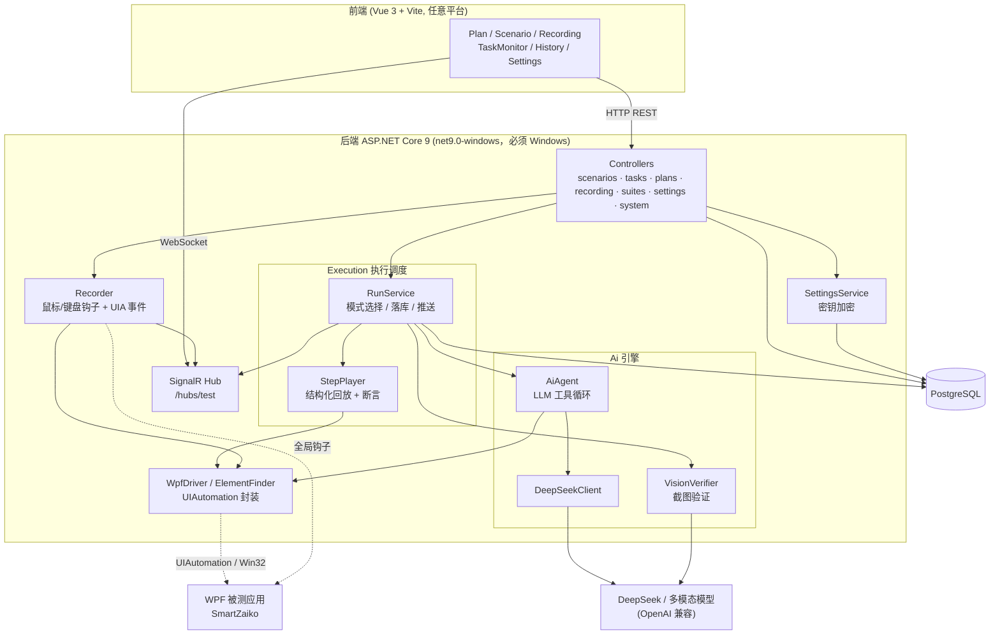
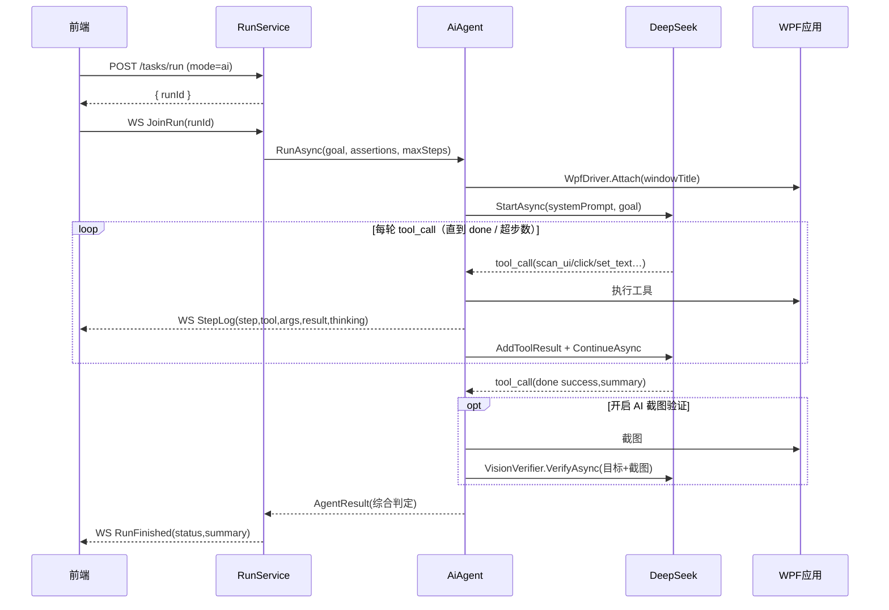
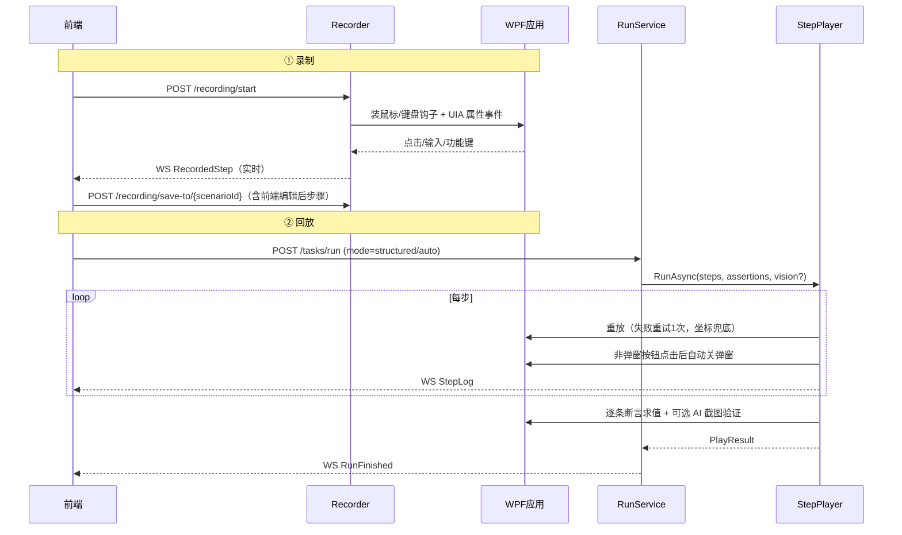

# TestPlatform 架构设计文档

> 版本：v2.0 ｜ 更新日期：2026-06-16 ｜ 适用代码：当前主干（纯 WPF 自动化）

本文描述 TestPlatform 的整体架构、技术选型理由、模块职责与关键数据流。
更细的接口/字段级设计见 [详细设计文档](design.md)，需求层面见 [需求设计文档](requirements.md)。

---

## 1. 系统定位

TestPlatform 是一套**针对 Windows 桌面（WPF）应用的自动化测试平台**，被测对象为日语仓库管理系统 SmartZaiko。
它解决两个核心痛点：

1. **不会写代码的测试人员也能造测试** —— 通过「录制操作 → 回放」生成结构化用例。
2. **界面/数据多变导致脚本脆弱** —— 通过「LLM 逐步推理操作」+「AI 截图验证结果」提升鲁棒性。

平台本身是 B/S 架构（浏览器操作 + 后端执行），但**执行引擎必须运行在被测桌面所在的 Windows 机器上**。

---

## 2. 总体架构



**部署边界**：前端（静态资源）可部署于任意平台；后端 + 执行引擎与被测 WPF 应用**同机运行于 Windows**，因为：

- UIAutomation / WPF Runtime 仅在 Windows 可用；
- 全局鼠标/键盘钩子、`AutomationElement.FromPoint`、`Screenshot` 都依赖本地桌面会话。

---

## 3. 技术选型与理由

| 层 | 选型 | 理由 |
|----|------|------|
| 后端框架 | ASP.NET Core 9（`net9.0-windows`，启用 `UseWPF`/`UseWindowsForms`） | 既能跑 Web API，又能引用 Windows Desktop 运行时（UIAutomation 在其中） |
| 桌面驱动 | System.Windows.Automation（UIAutomation） | 微软原生、对 WPF 控件树支持好；配合 `AutomationId` 稳定定位 |
| 录制 | Win32 低级钩子 + UIA 属性事件 | 钩子捕获点击/功能键，UIA 事件捕获文本输入/选项，三路合流还原真实操作 |
| ORM | SqlSugar + PostgreSQL | 轻量、CodeFirst 自动建表、`IsAutoCloseConnection` 适合短连接 |
| 实时推送 | ASP.NET Core SignalR | WebSocket 优先、分组（`run_{id}`/`recording`）天然契合「订阅一次执行」 |
| 操作 LLM | DeepSeek（`deepseek-chat`） | 成本低、Tool Calling 兼容 OpenAI 协议；只做文本推理不需识图 |
| 验证 LLM | 任意 OpenAI 兼容多模态模型 | 截图判定需识图，与操作模型解耦，可分别配置（如 `qwen-vl-max`/`gpt-4o`） |
| 前端 | Vue 3 + TS + Vite + Element Plus | 组件生态成熟、SignalR/Axios 集成简单、构建快 |

---

## 4. 模块职责

### 4.1 后端

| 模块 | 关键类型 | 职责 |
|------|----------|------|
| **Controllers** | `ScenarioController` `TaskController` `TestPlanController` `RecordingController` `SuiteController` `SettingsController` `SystemController` | REST 入口，参数校验、调度执行、查询落库数据 |
| **Hubs** | `TestHub` | SignalR 分组管理：`JoinRun/LeaveRun`、`JoinRecording/LeaveRecording` |
| **Execution** | `RunService` | **执行调度核心**：选模式（auto/structured/ai）、建 `TestRun`、落 `RunLog`、推 SignalR、汇总判定 |
| | `StepPlayer` | 结构化回放：逐步重放、失败重试、弹窗自动处理、断言求值、可选 AI 截图验证 |
| | `Assertion` | 结构化验证条件模型（`equals/contains/exists/textVisible/noDialog…`） |
| **Ai** | `AiAgent` | LLM 工具调用循环：`scan_ui→click→…→done`，每步回调推送 |
| | `DeepSeekClient` | DeepSeek 会话封装（对话历史、tool_call 解析、token 统计） |
| | `ToolSchemas` | 暴露给 LLM 的工具定义（点击/输入/选项/表格/弹窗/断言…） |
| | `VisionVerifier` | 截图 + 目标交多模态模型，解析首行「结论：通过/不通过」 |
| **Recording** | `Recorder` | 三路事件合流录制，防抖与噪声过滤，SignalR 实时推步骤 |
| | `HookHost` | 低级鼠标/键盘钩子宿主（`GCHandle` 固定委托防 GC 崩溃） |
| | `RecordedStep` | 录制步骤数据结构（action/target/value/gridId/x,y…） |
| **Wpf** | `WpfDriver` | 面向语义的操作 API：`Click/SetText/SelectItem/ClickCell/GetRowCount/TryGetDialog…` |
| | `ElementFinder` | 窗口/控件定位、坐标命中下钻、按钮内文字提升到可交互祖先 |
| | `Screenshot` `Input` | 区域截图（base64 PNG）、键盘模拟 |
| **Settings** | `SettingsService` | 两套 AI 配置存取，白名单键，敏感项加密、回退 `appsettings.json` |
| | `SecretProtector` | API Key 加解密 |
| **Logging** | `AiLog` `LogCleanupService` | AI 请求/响应落文件、按保留天数定期清理 |

### 4.2 前端（`web/testplatform-web/src/views`）

| 视图 | 路由 | 职责 |
|------|------|------|
| `PlanList` / `PlanDetail` | `/plans`、`/plans/:id` | 计划增删改、管理计划内场景与顺序 |
| `PlanRunView` / `PlanHistoryView` | `/plans/:planId/run/:runId`、`/plans/:id/history` | 计划批量执行监控与历史 |
| `ScenarioList` / `ScenarioEdit` | `/scenarios`、`/scenarios/:id/edit` | 场景列表/运行、编辑（参数/验证/录制步骤/AI验证） |
| `TaskMonitor` | `/monitor/:runId` | 单次执行实时监控（SignalR `StepLog`/`RunFinished`） |
| `RecordingView` | `/recording` | 录制控制 + 实时步骤流（SignalR `RecordedStep`），保存到场景 |
| `HistoryView` | `/history` | 全局执行历史 |
| `Settings` | `/settings` | 在线配置 AI 接口、默认窗口、日志保留与清理 |

---

## 5. 关键数据流

### 5.1 AI 推理执行



### 5.2 录制 → 结构化回放



### 5.3 测试计划批量执行

`TestPlanController.RunPlan` 建 `TestPlanRun` + N 个 `TestPlanRunItem`，后台 `Task.Run` 顺序执行：
每个场景调 `RunService.StartRunAsync` 拿到 `TestRunId` **立即回写**（前端即可拉该场景日志），
再轮询 `TestRun.Status` 到终态，更新 item 与计划统计；支持整批取消（`CancellationTokenSource`）。

---

## 6. 数据模型

```mermaid
erDiagram
    SCENARIO ||--o{ TEST_RUN : "执行产生"
    TEST_RUN ||--o{ RUN_LOG : "逐步日志"
    TEST_PLAN ||--o{ TEST_PLAN_SCENARIO : "包含(有序)"
    SCENARIO ||--o{ TEST_PLAN_SCENARIO : "被编入"
    TEST_PLAN ||--o{ TEST_PLAN_RUN : "批量执行"
    TEST_PLAN_RUN ||--o{ TEST_PLAN_RUN_ITEM : "每场景一项"
    TEST_PLAN_RUN_ITEM }o--|| TEST_RUN : "关联(可空)"
    SUITE ||--o{ SCENARIO : "归类(suite_id 可空)"

    SCENARIO {
        uuid id PK
        string type "wpf(web保留)"
        string windowTitle
        text description "AI目标/自然语言步骤"
        text stepsJson "录制步骤"
        text parametersJson
        text assertionsJson
        bool aiVerifyEnabled
        int maxSteps
    }
    TEST_RUN { uuid id PK; uuid scenarioId; string status; int totalSteps; int tokenUsed }
    RUN_LOG { uuid id PK; uuid runId; int stepNumber; string toolName; text result; text thinking; bool success }
```

- 主键统一 `uuid`（非自增），由 `DbContext` 的 `EntityService` 关掉 `IsIdentity`。
- 表由 `AppDbContext.InitDatabase()` CodeFirst 建立；`Program.cs` 启动时先 `EnsureDatabaseCreated`（必要时建库）再 `MigrateDatabase`（补列/改类型）。
- `TestSuite` 实体、`SuiteController` 与 `test_suites` 建表均已就绪（套件 API 可用）；前端套件管理 UI 仍待补（见 [TODO](TODO.md)）。

---

## 7. 横切关注点

- **并发与隔离**：`AppDbContext.CreateClient()` 每次返回新 `SqlSugarClient`（自动关连接），不跨请求复用。
- **录制/回放互斥**：执行前若正在录制，`RunService` 会先 `Recorder.Stop()` 并等 300ms，避免两套全局钩子冲突。
- **健壮性**：钩子委托用 `GCHandle` 固定防 GC 回收崩溃；落库与实时推送解耦（入库失败不吞实时日志）。
- **安全**：API Key 为敏感项，加密落库、接口只回传「是否已配置」而非明文；CORS 限定本地前端来源且 `AllowCredentials`（SignalR 需要）。
- **可观测**：AI 请求/响应写 `AiLog` 文件，`LogCleanupService` 按保留天数清理，`/api/system/logs/*` 可查看与手动清理。

---

## 8. 已知架构性约束

1. 后端与被测应用必须同机、同桌面会话（Windows），无法容器化/无头运行。
2. 仅支持单机串行执行（同一时刻一套全局钩子/前台焦点），不适合并行多用例。
3. Web/浏览器自动化尚未实现（`Type=web` 为占位）。
4. 前后端统一监听 `http://localhost:5000`（前端 baseURL 与 SignalR Hub 同源）。

> 后续规划与缺口清单见 [docs/TODO.md](TODO.md)。
